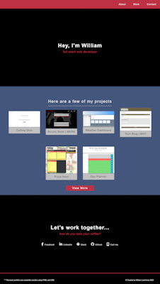
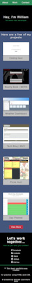

# Practice Portfolio with HTML and CSS (only)

## Description

I recently graduated from Vanderbilt University's Full Stack Coding Bootcamp. I wanted to hop online and test my ability to create projects from a well known online (free) coding bootcamp. After three days of completing challenges on their site, I decided to move away from their structure and requirements and put my knowledge to the test. I found a vast appreciation for what the staff at Vanderbilt and Trilogy had taught me. Not only did the site's code editor limit what I could do, but the requirements seemed to be very "book-like", and not very intuitive. This portfolio is the first of many I will be adding to my Github Repository.  

This portfolio is very simple and straight forward. It was created using only basic HTML and CSS. The projects featured in the Project Section are challenges and projects that were assigned to me while attending the Vanderbilt / Trilogy bootcamp.  

No matter how big or small, simple or complicated. I just simply WANT to continue coding everyday. Until next time...ENJOY and 'HAPPY CODING'!!!

<h3>Desktop:</h2> 
  

<h3>Mobile:</h2> 
 

<a href="https://wlowrimore.github.io/post_bc_continuing_simple_portfolio_2022/" target="_bland" rel="noreferrer">See it on Github Pages</a> 

## Languages Used:

- HTML 
- CSS 

&copy; William Lowrimore 2022
